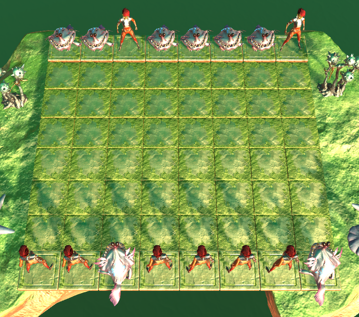
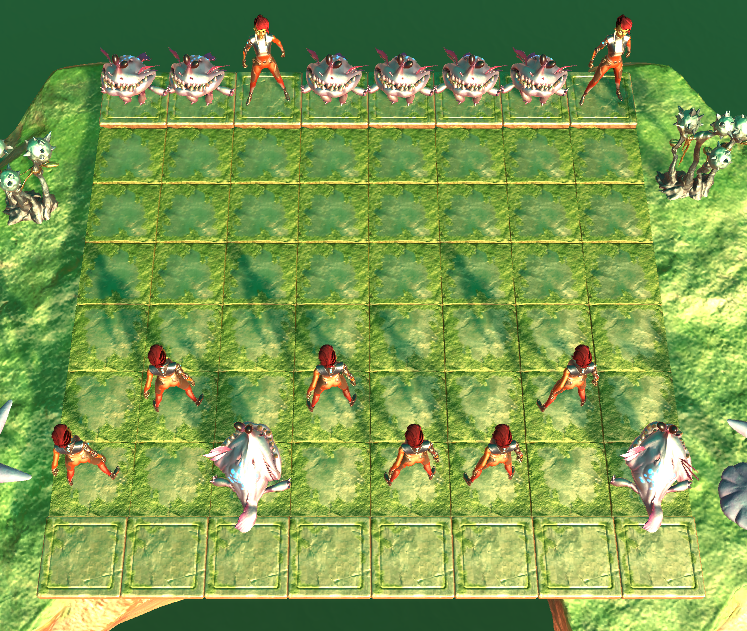
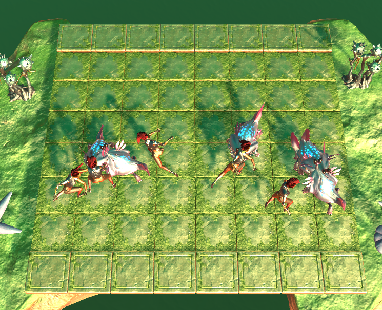
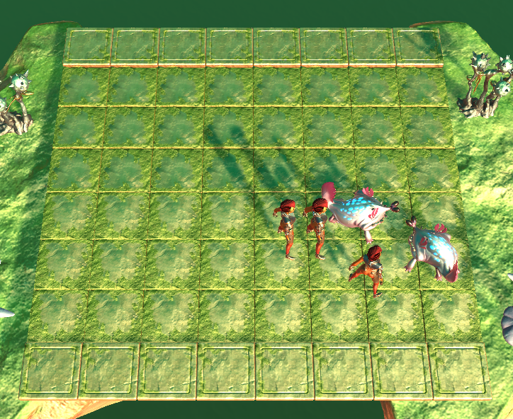

# Simple Autobattler
## Introduction
Simple Autobattler is a desktop game that implements the basic mechanics of "autobattler" genre games. Autobattler is a genre of strategy videogames that have recently risen in popularity. The most widely played autobattler games today include Riot's [Teamfight Tactics](https://na.leagueoflegends.com/en/featured/events/teamfight-tactics) and Valve's [Dota Underlords](https://underlords.com/).

Here is an [itch.io link to play it online or download it for PC](https://huabrandon0.itch.io/autobattler).

## Screenshots + Explanation

  

  The game starts with an empty board and full hands for both sides.
     

  

  The player places their units on their side of the board.
     

  

  Afterwards, the enemy AI places their units and battle commences.
     

  

  Eventually, one side's units is victorious!

## Tools/Assets Used
- [Unity 2019.2.0f1](https://unity.com/)
- [Unity's 3D Game Kit](https://assetstore.unity.com/packages/templates/tutorials/3d-game-kit-115747)
- [Kenney's Particle Pack](https://www.kenney.nl/assets/particle-pack)
